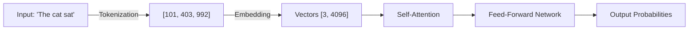
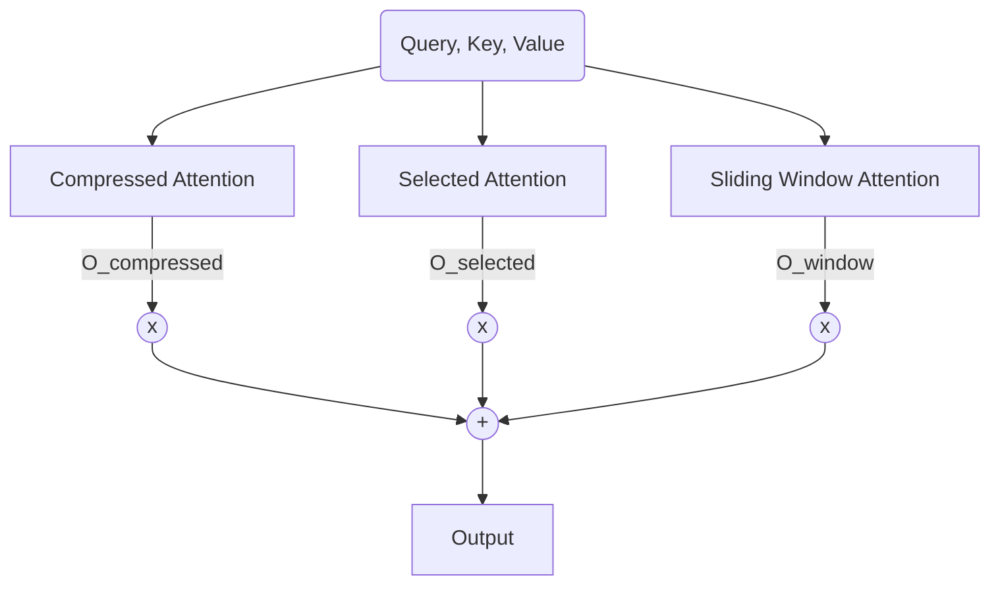

# DeepSeek Native Sparse Attention: From Transformer Basics to High-Performance Kernels

## Introduction

This essay provides a comprehensive journey through the implementation of DeepSeek's Native Sparse Attention (NSA) architecture. We will begin by establishing a fundamental understanding of Transformer models and the core attention mechanism. From there, we will explore the computational bottlenecks that necessitate sparse attention, examine the specific architectural innovations introduced by DeepSeek, and finally conducting a deep, line-by-line analysis of the provided `kernel.py` implementation, including the high-performance CUDA kernel written in TileLang.

---

## Part 1: The Foundations of Transformer Attention

To understand *sparse* attention, we must first understand *dense* attention and why it becomes prohibitively expensive for long sequences.

### 1.1 The Transformer Architecture

The Transformer, introduced in "Attention Is All You Need" (Vaswani et al., 2017), revolutionized natural language processing by dispensing with recurrence (RNNs) and convolutions (CNNs) in favor of a mechanism called **Self-Attention**.
A Transformer processes data as a **Sequence of Tokens**.



### 1.2 The Core Mechanism: Scaled Dot-Product Attention

The heart of the Transformer is the attention mechanism. For a given sequence of length $T$, the input is a matrix $X \in \mathbb{R}^{T \times D}$.

This input is projected into three distinct matrices:
- **Queries ($Q$)**: What the token is looking for.
- **Keys ($K$)**: What the token contains (its identity/content).
- **Values ($V$)**: The actual information to be retrieved.

Mathematically:
$$Q = X W_Q, \quad K = X W_K, \quad V = X W_V$$

The attention score is calculated as:
$$ \text{Attention}(Q, K, V) = \text{softmax}\left(\frac{QK^T}{\sqrt{d_k}}\right)V $$

#### Visualizing the Dot Product ($QK^T$)

Imagine we have 3 tokens. We compute similarity between *every* pair.

$$
\begin{bmatrix} q_1 \\ q_2 \\ q_3 \end{bmatrix} \cdot \begin{bmatrix} k_1 & k_2 & k_3 \end{bmatrix} = \begin{bmatrix} q_1 k_1 & q_1 k_2 & q_1 k_3 \\ q_2 k_1 & q_2 k_2 & q_2 k_3 \\ q_3 k_1 & q_3 k_2 & q_3 k_3 \end{bmatrix}
$$

This $T \times T$ matrix is the **Attention Map**. Each cell $(i, j)$ tells us: "How much should token $i$ pay attention to token $j$?"

### 1.3 The Quadratic Bottleneck: The $O(T^2)$ Problem

The $T \times T$ attention matrix is the source of the problem.
- **Compute Cost**: Calculating $QK^T$ requires $O(T^2 \cdot D)$ floating point operations (FLOPs).
- **Memory Cost**: Storing the attention matrix requires $O(T^2)$ memory.

```
      ^ Operations
      |
      |                                   / (Quadratic: T^2)
      |                                 _/
      |                               _/
      |                             _/
      |                           _/
      |                         _/
      |                       _/
      |                     _/
      |                   _/
      |                 _/
      |_______________/______________________> Sequence Length (T)
```
*(Note: Imagine a steeply rising parabola here. Doubling sequence length quadruples the cost.)*

For a short sequence like 512 tokens:
$512^2 = 262,144$ interactions. Trivial.

For a long context like 128,000 tokens (common in modern LLMs):
$128,000^2 \approx 16 \text{ billion}$ interactions *per head, per layer*.

This quadratic scaling makes naive dense attention impossible for very long sequences. We simply cannot compute or store a $128k \times 128k$ matrix.

---

## Part 2: The Evolution of Sparse Attention

Sparse attention aims to approximate the dense attention matrix by only computing a subset of the entries. If we can decide *which* interactions are important and ignore the rest, we can reduce the complexity.

### 2.1 Static Patterns (The "Fixed" Approach)
The earliest sparse attention mechanisms used fixed, predetermined patterns, primarily **Sliding Window**.

**Visualizing Sliding Window ($W=2$):**
Only the white cells are computed. The grey cells are ignored (treated as zero/negative infinity).

```
   k1 k2 k3 k4 k5
q1 [1  .  .  .  .]  (q1 sees k1)
q2 [1  1  .  .  .]  (q2 sees k1, k2)
q3 [.  1  1  .  .]  (q3 sees k2, k3) <-- sliding window
q4 [.  .  1  1  .]  (q4 sees k3, k4)
q5 [.  .  .  1  1]  (q5 sees k4, k5)
```
This is efficient ($O(T \cdot W)$) but fails to capture long-range dependencies (e.g., $q_5$ cannot see $k_1$).

### 2.2 Learned Patterns (The "Routing" Approach)
These methods try to *learn* which tokens are important.
- **Clustering**: Cluster queries and keys; only attend within clusters.
- **Routing**: Use a neural network to predict relevant blocks.

### 2.3 System Constraints: Block Sparsity
Modern GPUs rely on **memory coalescing**—reading large, continuous chunks of memory. Reading random individual floats is slow. Therefore, we use **Block Sparsity**. We divide the matrix into blocks (e.g., $64 \times 64$). We either compute the whole block or skip it.

---

## Part 3: DeepSeek Native Sparse Attention (NSA) Architecture

DeepSeek's NSA (arXiv:2502.11089) is a hybrid approach. It uses **Three Parallel Branches** and fuses them.

### 3.1 The Three-Branch Hypothesis



#### Branch 1: Compressed Attention (Coarse-Grained Global)
- **Idea**: Don't throw away tokens—**compress** them.
- **Mechanism**: Strided Convolution.
- **Math**:
  $$ K_c = \text{Conv1d}(K, \text{stride}=c) $$
  $$ V_c = \text{Conv1d}(V, \text{stride}=c) $$
  $$ \text{Attn}(Q, K_c, V_c) $$
- **Benefit**: Reduced sequence length ($T \to T/c$) means complexity drops by $c^2$ (or $c$ if Q is not compressed). It sees *everything*, just slightly blurry.

#### Branch 2: Selected Attention (Fine-Grained Sparse)
- **Idea**: Use the "blurry" view from Branch 1 to find the "interesting" parts, then look at those parts in full High Definition.
- **Procedure**:
    1.  Get attention weights from Compressed Branch: $A_{\text{compressed}}$.
    2.  Map these weights back to original blocks.
    3.  Select Top-K blocks with highest scores.
    4.  Compute standard attention *only on those blocks*.

#### Branch 3: Sliding Window Attention (Local)
- **Idea**: Always look at the immediate past to maintain grammar and fluency.
- **Mechanism**: Standard sliding window (as shown in 2.1).

### 3.2 Feature Fusion: Learned Gating
We combine the three branches using **Learned Gating**. For every token and head, we learn scalars:
$$ g_{\text{slc}} = \sigma(W_1 \cdot Q) $$
$$ g_{\text{swa}} = \sigma(W_2 \cdot Q) $$

The final output is a weighted sum:
$$ O = g_{\text{slc}} \cdot O_{\text{selected}} + g_{\text{swa}} \cdot O_{\text{window}} + (1 - g_{\text{slc}} - g_{\text{swa}}) \cdot O_{\text{compressed}} $$

This allows the model to dynamically decide per-token: "Do I need local grammar, precise retrieval, or a global overview?"

---

## Part 4: Code Deep Dive (`kernel.py`)

Now we turn to the provided implementation in `kernel.py`.

### 4.1 The Top-Level: `NativeSparseAttention`

This class orchestrates the whole process.

**Initialization**:
```python
self.compressed_attn = CompressedAttention(...)
self.window_attn = SlidingWindowAttention(...)
self.gate_slc = nn.Linear(dim, 1) # Learns g_slc
self.gate_swa = nn.Linear(dim, 1) # Learns g_swa
```

**Forward Pass**:
```python
# 1. Run Compressed Branch
O_compressed, attn_weights_c, ... = self.compressed_attn(Q, K, V)

# 2. Get Indices from Compressed Weights
block_indices = build_block_indices_from_compressed(attn_weights_c, ...)

# 3. Run Selected Branch (The TileLang Kernel)
O_selected = kernel_fn(Q, K, V, block_indices)

# 4. Run Window Branch
O_window = self.window_attn(Q, K, V)

# 5. Gate & Fuse
g_slc = sigmoid(self.gate_slc(Q))
g_swa = sigmoid(self.gate_swa(Q))
O = (1-g_slc-g_swa)*O_compressed + g_slc*O_selected + g_swa*O_window
```

### 4.2 Branch 1: `CompressedAttention`

**The Convolution**:
```python
self.conv_k = nn.Conv1d(..., stride=4, groups=heads*dim, ...)
```
Using `groups=in_channels` makes this a **Depthwise Convolution**. Each channel (dimension of the embedding) is convolved independently. We mix information *across time* (compressing 4 tokens into 1) but not *across features*. This is efficient and effective for summarization.

### 4.3 The specialized Core: TileLang Kernel

The **Selected Branch** uses a custom CUDA kernel written in TileLang. This is necessary because PyTorch cannot efficiently handle "ragged" or sparse block lists.

#### Tiling and Parallelism
The kernel uses FlashAttention-style tiling.

**Visualizing the Sparse Grid**:
Imagine the full $Q \times K$ matrix. We grid it into blocks.
Blue = Computed by Kernel.
White = Skipped (Zero).

```
   K_blk0 K_blk1 K_blk2 K_blk3 ...
Q0 [ BLUE   .      .     BLUE  ]  (Q0 attends to K0, K3)
Q1 [  .     BLUE  BLUE    .    ]  (Q1 attends to K1, K2)
Q2 [ BLUE   .      .      .    ]  (Q2 attends to K0)
...
```

The `block_indices` tensor tells the kernel exactly which blue blocks to compute:
`block_indices[Q0] = [0, 3]`
`block_indices[Q1] = [1, 2]`

#### Kernel Logic (Pseudo-code)
```python
@tilelang.jit
def kernel(Q, K, V, block_indices):
    # Parallelize over Query blocks (Q_tile)
    pid = tilelang.program_id(0) 
    
    # Load Q tile into faster Shared Memory
    Q_tile = load(Q[pid])
    
    # Iterate ONLY over selected blocks
    for i in range(num_selected):
        # 1. Get the block ID from our index list
        k_block_id = block_indices[pid, i]
        
        # 2. Load that specific Key/Value block
        K_tile = load(K[k_block_id])
        V_tile = load(V[k_block_id])
        
        # 3. Compute Attention for this block
        scores = Q_tile @ K_tile.T
        scores = softmax(scores) # (Online Softmax trick used here)
        output += scores @ V_tile
        
    return output
```

This transforms the loop from $O(T_{\text{total}})$ to $O(T_{\text{selected}})$, providing the massive speedup.

### 4.4 Branch 3: `SlidingWindowAttention`

The code implements this using standard masking.
```python
# Create a mask where (target < source - window) is True
window_mask = k_idx < (t_idx - W + 1)
# Apply mask (set to -infinity)
logits.masked_fill(window_mask, float("-inf"))
```
Visualizing the mask:
```
1 1 0 0 0
0 1 1 0 0
0 0 1 1 0
0 0 0 1 1
0 0 0 0 1
```
The bands of `1`s are the window. Everything else is masked out.

---

## Part 5: Indexing Strategy (`build_block_indices_from_compressed`)

This function bridges the Compressed branch and the Selected branch. It answers: **"How do we know which blocks are blue?"**

**Mapping High-Res to Low-Res**:
1.  **Run Compressed Attention**: Get weights $A_c$.
2.  **Scatter-Add**:
    - Each compressed token $t_c$ represents 4 original tokens (if stride=4).
    - If $t_c$ has high attention weight, we add that weight to the score of the block containing those 4 tokens.
    
    ```
    Compressed Token:  [  tc0  ] [  tc1  ] ...
    Weight:            [  0.1  ] [  0.9  ] ...
                          |         |
                          v         v
    Original Blocks:   [ Blk0  ] [ Blk1  ] ...
    Block Score:       [ +0.1  ] [ +0.9  ] ...
    ```
    
3.  **Local Bias**: We mathematically force the scores of the last 2 blocks to be infinity ($10^9$). This guarantees the kernel *always* attends to the immediate past, fixing any gaps the compressed branch might have missed.
4.  **Top-K**: We pick the indices with the highest scores.

---

## Conclusion

The `kernel.py` implementation is a faithful reproduction of the DeepSeek NSA architecture. It successfully navigates the trade-offs between global context (via Compression), local context (via Sliding Window), and precise retrieval (via Sparse Selection).

By fusing these three branches with learned gating, the model can adaptively choose its attention strategy. By leveraging TileLang for the sparse kernel, it achieves the hardware efficiency necessary to make this theoretically elegant architecture practically viable on modern GPUs.
